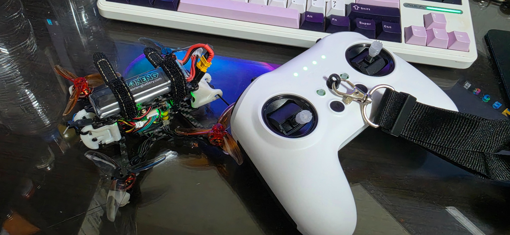
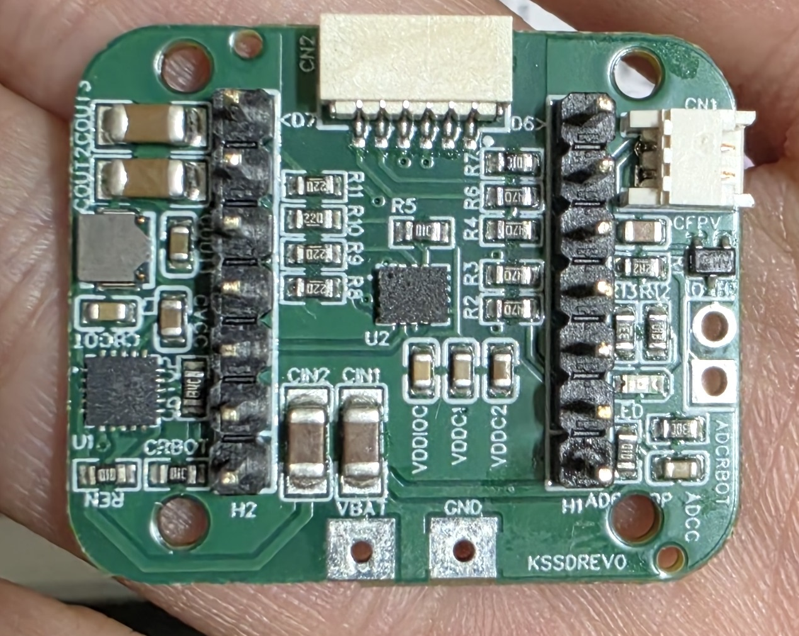

# ESP32-S3 Drone Firmware — Rev 1.3-b

> Seeed Studio XIAO ESP32-S3 기반 2.5인치 쿼드콥터 비행 제어 펌웨어입니다. Rev 1.3-b는 ESP-NOW 조종 링크를 ELRS/CRSF로 교체하고, 실제 조종기 입력·안전 절차와 야외 비행 검증까지 완료한 Rev1.x의 현재 안정화 버전입니다.

[English](#english)

## 프로젝트 개요

이 프로젝트는 센서 입력, 자세 추정, PID 제어, 상태 머신, 추력 보정, 모터 출력을 하나의 ESP32-S3 비행 제어기에 통합한 개인 제작 드론 펌웨어입니다.

Rev 1.3-b에서는 Rev 1.2의 multi-rate 비행 제어 구조를 유지하면서 전용 ESP-NOW 조종기 대신 RadioMaster 조종기와 ELRS 수신기를 사용하도록 통신 계층을 변경했습니다. CRSF RC 채널 수신, 명령 반복 전송, 통신 timeout, 스위치 edge 검출, 배터리 및 비행 모드 telemetry를 실제 제어 파이프라인에 통합했습니다.

## 현재 상태

| 항목 | 상태 |
| --- | --- |
| 현재 버전 | **Rev 1.3-b — ELRS/CRSF stabilization** |
| 빌드 및 기본 기능 | 확인 완료 |
| RadioMaster/ELRS 채널 동작 | 확인 완료 |
| 목표 main control rate | 2 kHz |
| ARMED 상태 실측 주기 | 약 1,850–1,870 Hz |
| Motor/DSHOT 출력 | 1 kHz |
| 실제 야외 비행 | **검증 완료** |
| 장거리 통신 범위 | 추가 검증 필요 |

## 개발 환경

| 항목 | 내용 |
| --- | --- |
| Flight controller | Seeed Studio XIAO ESP32-S3 |
| Framework | ESP-IDF 6.0 |
| RTOS | FreeRTOS |
| IMU | ICM-42688-P, SPI, 8 kHz ODR |
| Control link | ELRS UART / CRSF |
| Motor protocol | RMT 기반 DSHOT |
| Flight modes | RATE/ACRO, ANGLE/SELF-LEVEL |
| Language | C / C++ |

## 하드웨어 및 비행 테스트 미디어

### 완성 기체와 조종기

  

### 커스텀 Carrier Board

  

### Rev 1.3-b 야외 비행 테스트

실제 야외 비행은 `ANGLE_SELF_LEVEL` 모드에서 진행했습니다. 이 테스트에서 이륙, 상승, 기본 자세 제어, 완만한 하강과 ELRS/CRSF 조종 링크의 정상 동작을 확인했습니다.

급하강에서는 일시적인 yaw disturbance가 재현되었으며, 일반 상승·호버·완만한 하강에서는 지속적인 yaw 불안정이나 자세 발산이 관찰되지 않았습니다. 현재 기체에는 Optical Flow/ToF가 없으므로 위치 유지와 절대 고도 유지는 포함하지 않습니다.

**외부 촬영**

  

**FPV 카메라**

  

## CRSF 구현 범위

| 방향 | Frame | 용도 |
| --- | --- | --- |
| RX | `0x16 RC Channels Packed` | 16채널 조종 입력 수신 및 정규화 |
| RX | `0x14 Link Statistics` | 링크 상태 수신 |
| TX | `0x08 Battery Sensor` | 필터링된 배터리 전압 및 상태 송신 |
| TX | `0x21 Flight Mode` | 현재 비행 모드 송신 |

GPS frame(`0x02`)은 현재 구현 범위에서 제외했습니다. Link Statistics는 수신할 수 있지만 아직 비행 제어 판단에는 사용하지 않습니다. Telemetry는 비행 제어를 중단시키지 않는 best-effort 경로로 처리합니다.

## Rev 1.3-b 주요 변경점

### ELRS/CRSF 입력 확정

- ESP-NOW 기반 전용 조종기를 ELRS UART/CRSF 링크로 교체
- CRSF 16채널 decoding 및 stick 값 정규화
- 최신 정상 `ControlPacket` timestamp를 이용한 통신 timeout 판정
- critical section 기반 shared snapshot으로 통신 task와 비행 제어 task 사이의 데이터 tearing 방지
- 모든 정상 RC frame마다 증가하는 control sequence를 이용해 새 입력과 반복 snapshot 구분

### Stick 및 AUX switch 동작

| 입력 | 동작 |
| --- | --- |
| Roll / Pitch / Yaw | CRSF raw 값을 `-1.0 ~ 1.0`으로 정규화 |
| Throttle | 절대 위치형 `0.0 ~ 1.0` 입력 |
| SA | 누르는 동안 PREARM 활성 |
| SE | `LOW → HIGH`: ARM 요청, `HIGH → LOW`: DISARM 요청 |
| SB | `LOW → MID/HIGH`: SOFT LANDING 1회 요청 |
| SC LOW | `RATE_ACRO` (`mode 0`) |
| SC MID/HIGH | `ANGLE_SELF_LEVEL` (`mode 1`) |
| SD | 상승 edge에서 level/gyro bias calibration 요청 |

SB의 MID와 HIGH는 동일한 소프트 랜딩 활성 상태로 처리하므로 `MID ↔ HIGH` 이동에서는 추가 명령이 발생하지 않습니다. SC도 MID와 HIGH를 동일한 `ANGLE_SELF_LEVEL` 모드로 처리합니다.

### ARM 및 초기화 안전 조건

- 첫 정상 RC frame에서는 현재 switch 상태만 저장하여 전원 투입 직후의 의도하지 않은 명령 발생 방지
- 기동 후 SE의 LOW 상태를 한 번 확인한 뒤 `LOW → HIGH` edge에서만 ARM 허용
- ARM 시 SA PREARM 활성 필요
- ARM 시 throttle 최저 범위 확인
- SB SOFT LANDING이 비활성 상태일 때만 ARM 허용
- SE `HIGH → LOW` edge의 DISARM 요청을 다른 일반 명령보다 우선 처리
- 공중 및 LANDING 상태의 일반 DISARM 허용 여부는 FC 상태 머신에서 최종 판단
- 최초 SC 위치는 FC 비행 모드에 동기화

소프트 랜딩 후 FC가 DISARMED가 되어도 SE는 물리적으로 HIGH에 남아 있을 수 있습니다. 재ARM하려면 SE를 LOW로 내려 입력을 해제한 뒤, PREARM 조건을 만족하고 다시 HIGH로 올려야 합니다.

### 명령 전달 및 telemetry

- 새 명령을 동일한 `cmd_seq`와 `cmd_flags`로 5회 반복 전송
- FC는 `cmd_seq`로 동일 명령의 반복 frame을 한 번만 실행
- Battery Sensor와 Flight Mode telemetry를 각각 5 Hz로 송신
- Telemetry 송신 실패는 비행 제어 상태를 변경하지 않음
- 필터링된 배터리 전압과 배터리 상태를 telemetry에 반영

### 비행 제어 유지 및 보완

- Rev 1.2의 multi-rate 제어 파이프라인 유지
- quaternion 기반 gyro predict와 조건부 accelerometer correction 유지
- RATE/ACRO 및 ANGLE/SELF-LEVEL 모드 지원
- 저 throttle authority scaling, yaw priority/hover boost 및 TPA 적용
- thrust curve, 배터리 전압 보상, high-throttle 제한 및 수직 속도 damping 적용
- emergency stop 명령 수신 시 상태와 관계없이 모터 출력을 즉시 차단하는 FC 안전 경로 유지

## 현재 ARMED 파이프라인

1. **Command / Safety / Flight state** — CRSF snapshot, timeout, ARM/DISARM, soft landing, mode, calibration, target 및 failsafe 처리
2. **Sensor / Estimation** — IMU filtering, quaternion predict, gated gravity correction, attitude/vertical state 및 tilt safety 처리
3. **Attitude control** — angle-to-rate 변환, rate PID, authority scaling, yaw priority/boost 및 TPA
4. **Thrust compensation** — thrust curve, battery voltage compensation, high-throttle limit 및 vertical-speed damping
5. **Mixer / Motor output** — quad mixing, normalization, DSHOT 변환 및 RMT 출력

## Multi-rate 실행 구조

| 처리 항목 | 목표 또는 설정 |
| --- | ---: |
| Main control / IMU fast processing / rate PID | 2 kHz target |
| Motor / DSHOT output | 1 kHz |
| Safety 및 command background jobs | fast periodic path |
| Battery monitoring | 20 Hz |
| CRSF telemetry 합계 | 10 Hz |
| Battery / Flight mode telemetry | 각각 5 Hz |

세부 추정·보상 항목은 계산 비용과 필요한 응답 속도에 따라 main loop의 분주 주기로 실행합니다.

## 측정 결과

| Control link | ARMED 상태 main loop |
| --- | ---: |
| ESP-NOW | 약 1,880–1,900 Hz |
| ELRS/CRSF | 약 1,850–1,870 Hz |

- CRSF 전환 후 약 30 Hz, 약 1.6%의 추가 처리 비용이 확인되었습니다.
- 목표 2 kHz 대비 현재 평균 loop time은 약 535–541 μs입니다.
- 통신 변경 자체의 영향은 작으며, 2 kHz 미달의 주원인은 ESP32-S3에서 센서 처리, 추정, 제어, 상태 머신과 통신을 함께 수행하는 전체 연산 부하입니다.
- 현재 Rev1.x에서는 약 1.85–1.87 kHz를 실용적인 안정 동작 범위로 사용합니다.

## 알려진 한계 및 향후 개선

### 1. 동시 command event 보존

현재 한 RC frame에서 여러 switch edge가 동시에 발생하면 우선순위에 따라 하나의 명령만 단일 command slot에 저장합니다. 선택된 명령은 5회 반복되지만, 같은 frame에서 선택되지 않은 event는 이전 switch 상태가 갱신되면서 유실될 수 있습니다.

향후 개선 방향:

- 한 frame에서 발생한 event를 bit flag로 모두 저장
- 안전 우선순위에 따라 event를 하나씩 선택
- 선택한 각 명령을 동일한 sequence로 5회 반복 전송
- 반복 완료 후 다음 pending event 처리
- DISARM 또는 SOFT LANDING 발생 시 대기 중인 ARM 등 상충 event 취소
- ARM은 실제 전송 시점에도 PREARM, throttle 및 landing 조건 재확인

### 2. CRSF 오류 frame의 조기 판별

현재 parser는 sync byte와 length 범위를 먼저 검사하지만, 범위 안의 잘못된 length가 들어오면 선언된 길이만큼 수신한 뒤 CRC에서 오류를 확인합니다. 이 과정에서 다음 정상 frame의 일부를 손상된 frame에 포함할 수 있습니다.

ELRS의 빠른 통신 주기 때문에 실제 복구 지연은 비교적 짧지만, 다음 조건을 추가하여 더 빠른 오류 판별과 재동기화를 적용할 수 있습니다.

- frame type별 허용 length 검사
- 지원하는 address 및 frame type 선행 검사
- inter-byte timeout으로 불완전 frame 폐기
- CRC 실패 후 다음 sync 후보 탐색
- 오류 및 재동기화 통계 기록

### 3. ESP32-S3 timing margin

- 목표 2 kHz에 비해 실제 main loop는 약 1,850–1,870 Hz입니다.
- blocking RMT DSHOT 출력은 여전히 큰 시간 제약입니다.
- 4 kHz control loop는 현재 구조에서 현실적으로 어렵습니다.
- 확실한 2 kHz 이상 주기와 추가 센서 처리는 STM32 기반 Rev2에서 진행할 예정입니다.

### 4. 위치 및 고도 유지

현재 기체에는 Optical Flow와 ToF가 없어 XY 위치 유지와 절대 고도 유지 기능이 없습니다. 해당 기능은 센서 신뢰도, 바닥 무늬, 조명, 반사율 및 연산 자원을 함께 고려해야 하므로 Rev1.3-b 범위에서 제외했습니다.

## 다음 단계 — Rev2

Rev1.3-b는 ESP32-S3 기반 Rev1.x의 현재 안정화 지점입니다. 다음 하드웨어 revision은 STM32 기반으로 전환하며 다음 항목을 목표로 합니다.

- 2 kHz 이상 비행 제어 주기의 안정적 확보
- non-blocking motor output 및 timing margin 개선
- command event bit queue와 안전 취소 정책 적용
- CRSF frame 조기 검증 및 timeout 기반 재동기화
- OSD용 추가 UART 확보
- Optical Flow/ToF 등 추가 센서 확장성 검토

---

# ESP32-S3 Drone Firmware — Rev 1.3-b

> Flight-control firmware for a 2.5-inch quadcopter based on the Seeed Studio XIAO ESP32-S3. Rev 1.3-b is the current stabilized and outdoor-tested Rev1.x release, replacing the custom ESP-NOW controller link with ELRS/CRSF and finalizing the transmitter input and safety workflow.

## Overview

The firmware integrates sensor acquisition, attitude estimation, PID control, a flight-state machine, thrust compensation, and motor output on a single ESP32-S3 flight controller.

Rev 1.3-b retains the multi-rate control architecture introduced in Rev 1.2 while migrating the control link to a RadioMaster transmitter and ELRS receiver. It integrates CRSF RC input, repeated command delivery, communication timeout handling, switch-edge detection, and battery/flight-mode telemetry into the flight-control pipeline.

## Current Status

| Item | Status |
| --- | --- |
| Current revision | **Rev 1.3-b — ELRS/CRSF stabilization** |
| Build and basic functions | Verified |
| RadioMaster/ELRS channel behavior | Verified |
| Target main control rate | 2 kHz |
| Measured ARMED rate | Approximately 1,850–1,870 Hz |
| Motor/DSHOT output | 1 kHz |
| Outdoor flight test | **Verified** |
| Long-range link test | Further validation required |

## Development Environment

| Item | Details |
| --- | --- |
| Flight controller | Seeed Studio XIAO ESP32-S3 |
| Framework | ESP-IDF 6.0 |
| RTOS | FreeRTOS |
| IMU | ICM-42688-P over SPI, 8 kHz ODR |
| Control link | ELRS UART / CRSF |
| Motor protocol | RMT-based DSHOT |
| Flight modes | RATE/ACRO and ANGLE/SELF-LEVEL |
| Languages | C / C++ |

## Hardware and Flight-Test Media

### Complete Aircraft and Controller

  

### Custom Carrier Board

  

### Rev 1.3-b Outdoor Flight Test

The outdoor validation flight was performed in `ANGLE_SELF_LEVEL` mode. The test verified takeoff, climb, basic attitude control, gentle descent, and normal ELRS/CRSF control-link operation.

A transient yaw disturbance was reproducible during rapid descent. No sustained yaw instability or attitude divergence was observed during normal climb, hover, or gentle descent. The current aircraft has no Optical Flow/ToF sensors, so position hold and absolute altitude hold are outside this test scope.

**External camera**

  

**FPV camera**

  

## CRSF Scope

| Direction | Frame | Purpose |
| --- | --- | --- |
| RX | `0x16 RC Channels Packed` | Receive and normalize 16 RC channels |
| RX | `0x14 Link Statistics` | Receive link status |
| TX | `0x08 Battery Sensor` | Transmit filtered battery voltage and state |
| TX | `0x21 Flight Mode` | Transmit the current flight mode |

The GPS frame (`0x02`) is intentionally excluded. Link Statistics can be received but are not yet used for flight-control decisions. Telemetry is handled as a best-effort path and cannot stop flight control.

## Rev 1.3-b Highlights

### ELRS/CRSF input

- Replaced the custom ESP-NOW controller with an ELRS UART/CRSF link
- Added CRSF 16-channel decoding and stick normalization
- Detects communication timeout from the timestamp of the latest valid `ControlPacket`
- Uses critical-section-protected shared snapshots to prevent data tearing between communication and flight-control tasks
- Uses an incrementing control sequence to distinguish new RC input from repeated snapshot reads

### Stick and AUX switch mapping

| Input | Behavior |
| --- | --- |
| Roll / Pitch / Yaw | Normalize CRSF raw values to `-1.0 ... 1.0` |
| Throttle | Absolute-position input mapped to `0.0 ... 1.0` |
| SA | PREARM while held |
| SE | `LOW → HIGH`: ARM request; `HIGH → LOW`: DISARM request |
| SB | `LOW → MID/HIGH`: one SOFT LANDING request |
| SC LOW | `RATE_ACRO` (`mode 0`) |
| SC MID/HIGH | `ANGLE_SELF_LEVEL` (`mode 1`) |
| SD | Rising edge requests level/gyro-bias calibration |

SB MID and HIGH are treated as the same landing-active state, so moving between them does not generate another command. SC MID and HIGH both select `ANGLE_SELF_LEVEL`.

### Arming and startup safety

- The first valid RC frame captures switch states without generating unintended startup commands
- Arming requires observing SE LOW at least once before a `LOW → HIGH` edge
- SA PREARM must be active
- Throttle must be within the minimum range
- SB SOFT LANDING must be inactive
- A `HIGH → LOW` DISARM request has priority over normal commands
- The FC state machine makes the final decision on ordinary DISARM requests while airborne or landing
- The initial SC position is synchronized to the FC flight mode

After a soft landing, the FC may be DISARMED while SE remains physically HIGH. Re-arming requires returning SE to LOW, satisfying the PREARM conditions, and then moving it to HIGH again.

### Command delivery and telemetry

- Repeats each new command five times with the same `cmd_seq` and `cmd_flags`
- The FC executes repeated frames only once by de-duplicating `cmd_seq`
- Sends Battery Sensor and Flight Mode telemetry at 5 Hz each
- Telemetry failures do not alter the flight state
- Reports filtered battery voltage and battery state through telemetry

## ARMED Pipeline

1. **Command / Safety / Flight state** — CRSF snapshot, timeout, ARM/DISARM, soft landing, mode, calibration, target, and failsafe handling
2. **Sensor / Estimation** — IMU filtering, quaternion prediction, gated gravity correction, attitude/vertical state, and tilt safety
3. **Attitude control** — angle-to-rate conversion, rate PID, authority scaling, yaw priority/boost, and TPA
4. **Thrust compensation** — thrust curve, battery-voltage compensation, high-throttle limiting, and vertical-speed damping
5. **Mixer / Motor output** — quad mixing, normalization, DSHOT conversion, and RMT output

## Measured Performance

| Control link | ARMED main loop |
| --- | ---: |
| ESP-NOW | Approximately 1,880–1,900 Hz |
| ELRS/CRSF | Approximately 1,850–1,870 Hz |

- The CRSF migration reduced the measured main-loop rate by roughly 30 Hz, or about 1.6%.
- The current mean loop time is approximately 535–541 μs against the 500 μs target.
- The control-link overhead is small; the main limitation is the total ESP32-S3 workload from sensing, estimation, control, state handling, and communication.
- Rev1.x therefore uses approximately 1.85–1.87 kHz as its practical stable operating range.

## Known Limitations and Planned Improvements

### Concurrent command events

The current implementation stores only one command from multiple switch edges detected in the same RC frame. The selected command is repeated five times, but lower-priority events can be lost after the previous switch states are updated.

The planned design captures every event as a bit flag, selects events by safety priority, repeats each selected command five times, and then processes the next pending event. Conflicting events such as a pending ARM after DISARM or SOFT LANDING will be cancelled, and ARM conditions will be revalidated when the command is transmitted.

### Early CRSF error detection

The parser validates the sync byte and length range immediately, but a corrupted length that remains within the legal range is detected only after the declared frame has been received and its CRC fails. This can consume part of the following valid frame.

Planned improvements include type-specific length checks, supported-address/type validation, an inter-byte timeout, CRC-failure resynchronization, and recovery statistics.

### ESP32-S3 timing margin

- The measured 1,850–1,870 Hz main loop remains below the 2 kHz target.
- Blocking RMT DSHOT output is still a major timing constraint.
- A 4 kHz control loop is impractical with the current architecture.
- Stable 2 kHz-or-higher control and additional sensor processing are deferred to the STM32-based Rev2 design.

### Position and altitude hold

The current aircraft has no Optical Flow or ToF sensors, so XY position hold and absolute altitude hold are unavailable. These features are outside the Rev 1.3-b scope because they require joint validation of sensor reliability, floor texture, lighting, reflectivity, and processing resources.

## Next Stage — Rev2

Rev 1.3-b is the current stabilization point for the ESP32-S3-based Rev1.x platform. The STM32-based Rev2 design targets:

- Stable flight-control rates of 2 kHz or higher
- Non-blocking motor output and improved timing margin
- A bit-based pending-command queue with safety cancellation policies
- Early CRSF validation and timeout-based parser resynchronization
- An additional UART for OSD
- Expansion options for Optical Flow, ToF, and other sensors
